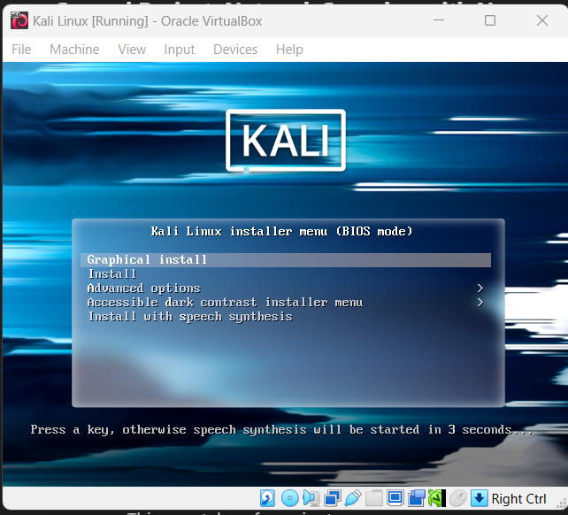
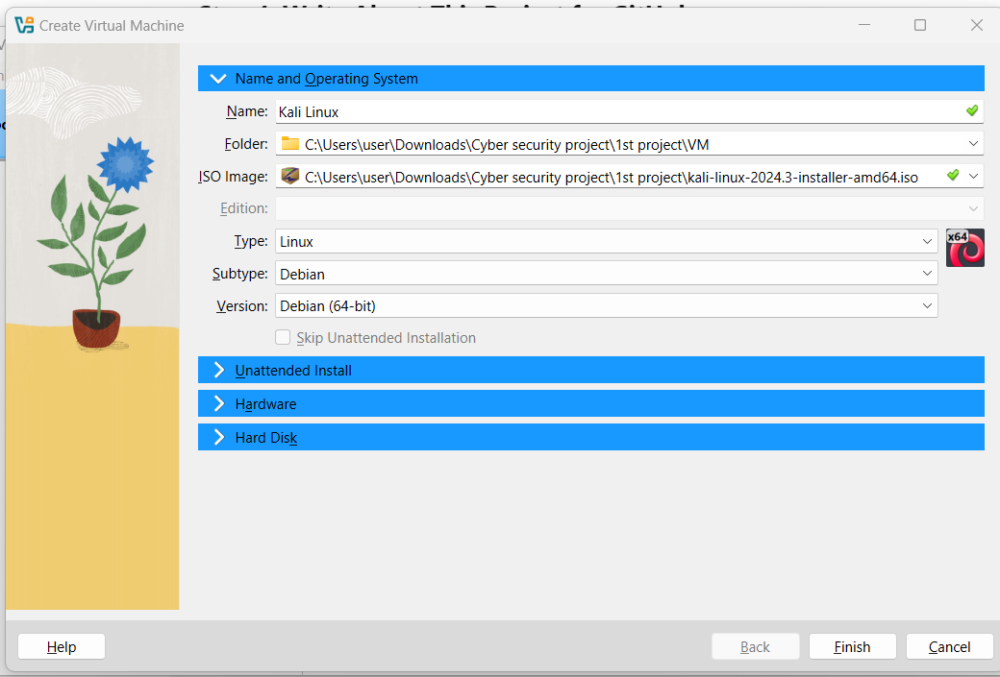
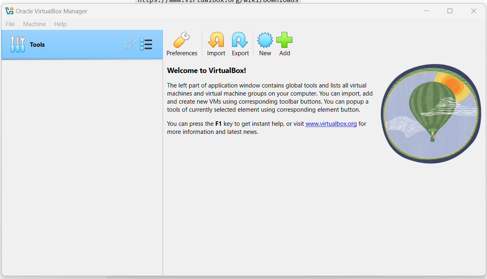
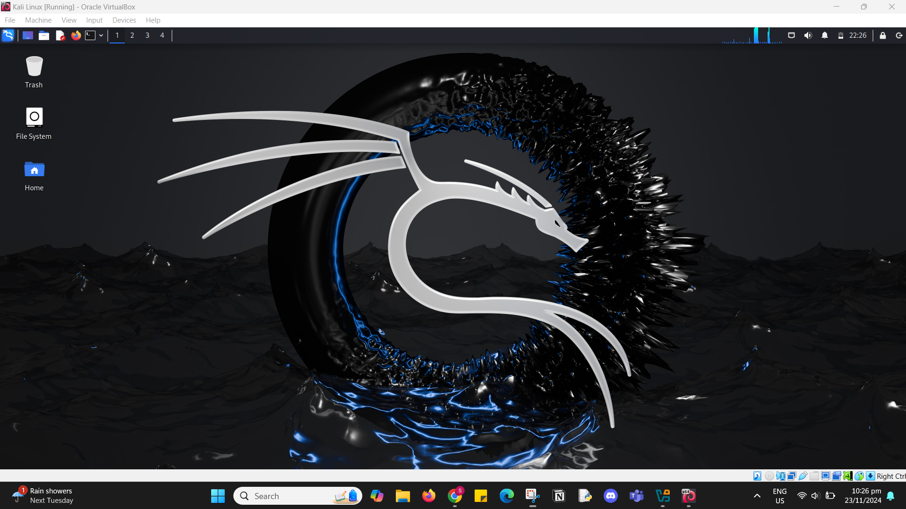
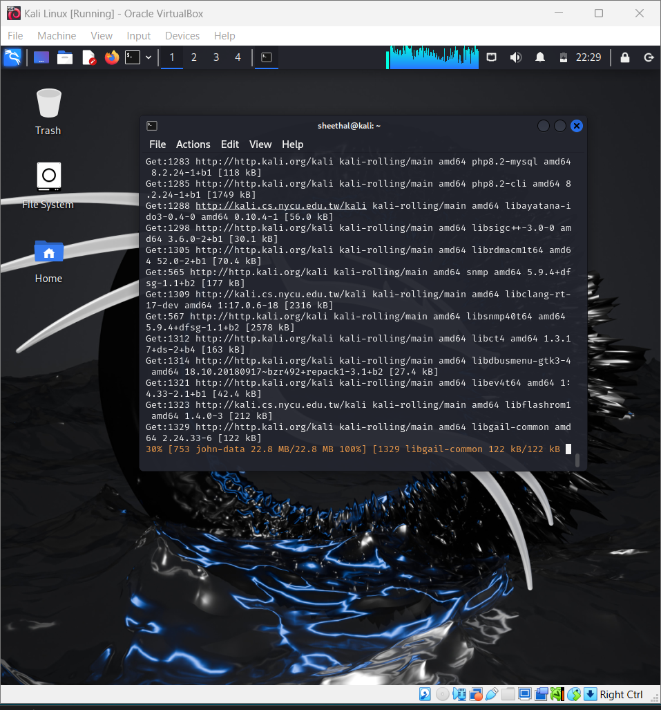
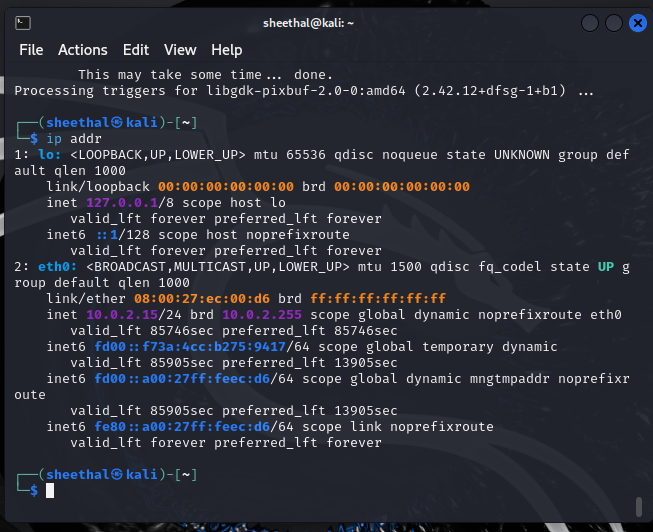
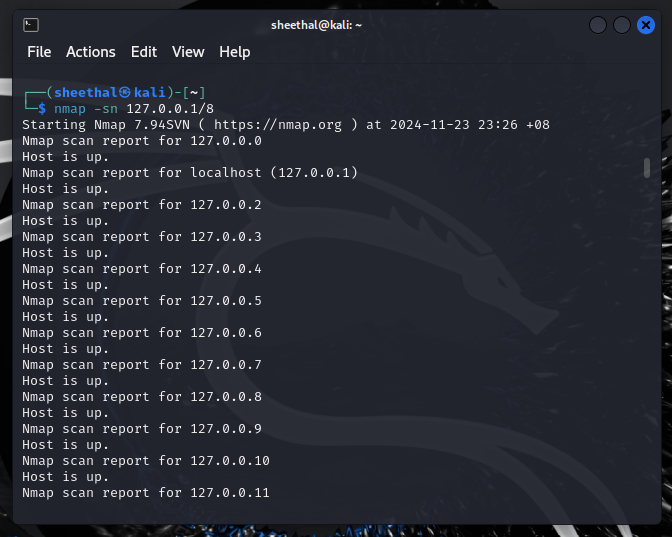

# Cybersecurity Lab Setup and Loopback Scanning with Nmap

## About the Project
As my first step into cybersecurity, I created a virtual lab environment using VirtualBox and Kali Linux. The goal was to understand and explore foundational networking concepts by performing a loopback scan using Nmap. This project showcases my ability to set up and use essential cybersecurity tools and environments.

---

## Objectives
- Set up a secure virtual lab for cybersecurity tasks.
- Use Kali Linux and Nmap to perform a loopback network scan.
- Demonstrate an understanding of IP addresses and network ranges.

---

## My Workflow

### Step 1: Virtual Lab Setup
1. Installed VirtualBox on my system to enable virtualization.
2. Downloaded Kali Linux and created a virtual machine in VirtualBox.
3. Configured the VM with:
   - **RAM**: 2 GB
   - **Disk Space**: 20 GB
4. Successfully installed Kali Linux and configured it as my cybersecurity lab.

### Step 2: Updating the Environment
1. Used the Linux terminal to update the system and tools:
   ```bash
   sudo apt update && sudo apt upgrade -y
   ```
2. Ensured the system was ready for the network scanning task.

### Step 3: Loopback Network Scan
1. Ran an Nmap scan to analyze the loopback network (`127.0.0.1/8`):
   ```bash
   nmap -sn 127.0.0.1/8 > loopback_scan_results.txt
   ```
2. The scan results showed details about my local system's network.

### Step 4: Documenting Results
1. Saved the scan results to a file: `loopback_scan_results.txt`.
2. Reviewed the file and took notes on the identified services and devices.
3. Captured screenshots of the process for my portfolio.

---

## Key Results
- Successfully set up a virtual lab with Kali Linux in VirtualBox.
- Ran a basic network scan on the loopback address (`127.0.0.1`).
- Learned the purpose of the loopback network and how to use Nmap effectively.

---

## Skills Demonstrated
1. Setting up virtual machines with VirtualBox.
2. Installing and configuring Kali Linux for cybersecurity tasks.
3. Using Linux terminal commands to update and maintain the environment.
4. Performing basic network scans with Nmap and saving the results for analysis.

---

## Challenges and How I Overcame Them
- **Challenge**: Initially, I didn't understand why `127.0.0.1/8` was shown instead of my local network range.
  - **Solution**: I researched the purpose of the loopback address and understood that it represents the local system for testing purposes.
- **Challenge**: Configuring the GRUB bootloader during installation was confusing.
  - **Solution**: I carefully followed documentation and troubleshooting guides to complete the setup.

---

## Future Improvements
1. Expand the lab setup to include multiple virtual machines for advanced testing.
2. Perform network scans on my actual local network (e.g., `192.168.x.x/24`) instead of the loopback network.
3. Explore more Nmap features, such as port scanning and OS detection.
4. Experiment with other cybersecurity tools available in Kali Linux.

---

## Screenshots
## Screenshots

### Step 1: VirtualBox setup for Kali Linux
,
,
,


### Step 2: Nmap command in the Kali Linux terminal


### Step 3: Scan results showing the loopback network


### Step 4: File output with saved results



---

## Repository Details
- **Repository Name**: Cybersecurity-Lab-Setup
- **Files Included**:
  - `README.md`: This project description.
  - **Screenshots**: Images documenting the process.
  - `loopback_scan_results.txt`: The saved Nmap scan results with anonymized data.
